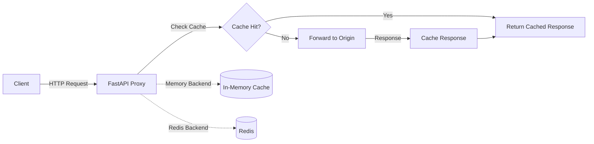

# 🚀 Caching Proxy Server

A high-performance, intelligent HTTP caching proxy server built with **FastAPI** that dramatically reduces latency and bandwidth usage by caching HTTP responses. Supports both in-memory and Redis-based caching backends with automatic cache invalidation and smart caching strategies.

[](https://fastapi.tiangolo.com)
[](https://www.python.org)
[](https://www.docker.com)
[](https://redis.io)

---

## ✨ Features

- 🎯 **Smart Caching** - Intelligent response caching with configurable TTL
- ⚡ **High Performance** - Built on FastAPI with async/await support
- 🔄 **Dual Backend Support** - Choose between in-memory or Redis caching
- 📊 **Real-time Statistics** - Track cache hits, misses, and hit rates
- 🛡️ **Production Ready** - Docker containerized with health checks
- 🔍 **Cache Management** - Full CRUD operations on cached items
- 🌐 **Direct Proxy Mode** - Transparent HTTP proxy via `/http/` paths
- 📈 **LRU Eviction** - Automatic cache eviction when memory limits are reached
- 🔒 **Security First** - Non-root Docker user and secure defaults

---

## 🏗️ Architecture



### Components

- **FastAPI Application** - Async HTTP proxy with middleware support
- **Cache Manager** - Abstraction layer for different cache backends
- **Memory Backend** - Fast in-memory LRU cache with TTL support
- **Redis Backend** - Distributed caching with persistence
- **Statistics Tracker** - Real-time metrics collection

---

## 🚀 Quick Start

### Using Docker Compose (Recommended)

1. **Clone and navigate to the project:**
   ```bash
   cd caching-proxy-server
   ```

2. **Start the services:**
   ```bash
   docker-compose up -d
   ```

3. **Verify it's running:**
   ```bash
   curl http://localhost:8000/health
   ```

That's it! 🎉 The proxy server is now running on `http://localhost:8000`

### Using Docker Only

```bash
# Build the image
docker build -t caching-proxy-server .

# Run with memory cache
docker run -d -p 8000:8000 \
  -e CACHE_BACKEND=memory \
  --name proxy-server \
  caching-proxy-server

# Run with Redis (requires Redis running separately)
docker run -d -p 8000:8000 \
  -e CACHE_BACKEND=redis \
  -e REDIS_URL=redis://your-redis-host:6379 \
  --name proxy-server \
  caching-proxy-server
```

### Local Development

```bash
# Create virtual environment
python -m venv venv
source venv/bin/activate  # On Windows: venv\Scripts\activate

# Install dependencies
pip install -r requirements.txt

# Run the server
python main.py
```

---

## 📖 API Documentation

### 🔹 Proxy Request

**Endpoint:** `POST /proxy`

Proxy an HTTP request through the caching layer.

**Request Body:**
```json
{
  "url": "https://api.example.com/data",
  "method": "GET",
  "headers": {
    "User-Agent": "CachingProxy/1.0"
  },
  "params": {
    "page": 1,
    "limit": 10
  }
}
```

**Query Parameters:**
- `ttl` (optional): Custom cache TTL in seconds

**Example:**
```bash
curl -X POST http://localhost:8000/proxy \
  -H "Content-Type: application/json" \
  -d '{
    "url": "https://jsonplaceholder.typicode.com/posts/1",
    "method": "GET"
  }'
```

**Response:**
```json
{
  "status_code": 200,
  "content": "...",
  "headers": {...},
  "from_cache": false,
  "cache_key": "abc123..."
}
```

---

### 🔹 Direct Proxy Mode

**Endpoint:** `GET|POST /http/{target_url}`

Transparent proxy mode - just prefix your URL with `/http/`.

**Examples:**
```bash
# Proxy a GET request
curl http://localhost:8000/http/jsonplaceholder.typicode.com/posts/1

# Proxy with query parameters
curl "http://localhost:8000/http/api.github.com/users/octocat?per_page=5"

# Proxy a POST request
curl -X POST http://localhost:8000/http/httpbin.org/post \
  -H "Content-Type: application/json" \
  -d '{"key": "value"}'
```

---

### 🔹 Cache Statistics

**Endpoint:** `GET /stats`

Get real-time caching statistics.

**Example:**
```bash
curl http://localhost:8000/stats
```

**Response:**
```json
{
  "hits": 150,
  "misses": 50,
  "total_requests": 200,
  "hit_rate": 75.0,
  "cache_backend": "memory"
}
```

---

### 🔹 Cache Information

**Endpoint:** `GET /cache/info/{cache_key}`

Get details about a specific cached item.

**Example:**
```bash
curl http://localhost:8000/cache/info/abc123def456
```

---

### 🔹 Delete Cache Item

**Endpoint:** `DELETE /cache/{cache_key}`

Remove a specific item from cache.

**Example:**
```bash
curl -X DELETE http://localhost:8000/cache/abc123def456
```

---

### 🔹 Clear All Cache

**Endpoint:** `DELETE /cache/clear`

Clear the entire cache (memory backend only).

**Example:**
```bash
curl -X DELETE http://localhost:8000/cache/clear
```

---

### 🔹 Health Check

**Endpoint:** `GET /health`

Check if the service is healthy.

**Example:**
```bash
curl http://localhost:8000/health
```

**Response:**
```json
{
  "status": "healthy",
  "cache_backend": "memory",
  "timestamp": 1701234567.89
}
```

---

## ⚙️ Configuration

### Environment Variables

| Variable | Default | Description |
|----------|---------|-------------|
| `HOST` | `0.0.0.0` | Server bind address |
| `PORT` | `8000` | Server port |
| `CACHE_BACKEND` | `memory` | Cache backend: `memory` or `redis` |
| `CACHE_TTL` | `300` | Default cache TTL in seconds (5 minutes) |
| `MAX_CACHE_SIZE` | `1000` | Maximum cache entries (memory backend) |
| `REDIS_URL` | `redis://localhost:6379` | Redis connection URL |

### Configuration Examples

**Memory Cache (Default):**
```env
CACHE_BACKEND=memory
CACHE_TTL=300
MAX_CACHE_SIZE=1000
```

**Redis Cache:**
```env
CACHE_BACKEND=redis
REDIS_URL=redis://redis:6379
CACHE_TTL=600
```

**Custom Configuration:**
```bash
# Copy example env file
cp .env.example .env

# Edit configuration
nano .env

# Restart services
docker-compose restart
```

---

## 🐳 Docker Commands

### Build & Run

```bash
# Build the image
docker build -t caching-proxy-server .

# Run with docker-compose
docker-compose up -d

# View logs
docker-compose logs -f proxy

# Stop services
docker-compose down

# Stop and remove volumes
docker-compose down -v
```

### Switching Cache Backends

**To Memory Cache:**
```bash
# Edit docker-compose.yml or set environment variable
export CACHE_BACKEND=memory
docker-compose up -d
```

**To Redis Cache:**
```bash
export CACHE_BACKEND=redis
docker-compose up -d
```

---

## 📊 Performance & Benchmarks

### Cache Performance

- **Memory Backend**: Sub-millisecond cache hits
- **Redis Backend**: 1-5ms cache hits (network dependent)
- **Cache Miss**: Depends on origin server response time

### Typical Use Cases

✅ **API Response Caching** - Cache expensive API calls  
✅ **Static Content Proxy** - Reduce bandwidth for static assets  
✅ **Rate Limit Protection** - Serve cached responses during rate limits  
✅ **Microservices** - Cache inter-service communication  
✅ **Development** - Mock external APIs with cached responses  

---

## 🔧 Troubleshooting

### Common Issues

**1. Container won't start**
```bash
# Check logs
docker-compose logs proxy

# Verify port availability
netstat -an | grep 8000
```

**2. Redis connection failed**
```bash
# Check Redis is running
docker-compose ps redis

# Test Redis connection
docker-compose exec redis redis-cli ping
```

**3. Cache not working**
```bash
# Check cache statistics
curl http://localhost:8000/stats

# Verify cache backend setting
docker-compose exec proxy env | grep CACHE_BACKEND
```

**4. High memory usage**
```bash
# Reduce MAX_CACHE_SIZE
# Edit docker-compose.yml or .env
MAX_CACHE_SIZE=500

# Restart
docker-compose restart proxy
```

---

## 🛠️ Development

### Project Structure

```
caching-proxy-server/
├── main.py              # FastAPI application & endpoints
├── cache_backends.py    # Cache backend implementations
├── config.py            # Configuration management
├── models.py            # Pydantic models
├── requirements.txt     # Python dependencies
├── Dockerfile           # Docker image definition
├── docker-compose.yml   # Multi-container setup
├── .dockerignore        # Docker build exclusions
├── .env.example         # Environment template
└── README.md            # This file
```

### Running Tests

```bash
# Install dev dependencies
pip install pytest httpx pytest-asyncio

# Run tests (create test file first)
pytest tests/
```

### API Documentation

Once running, visit:
- **Swagger UI**: http://localhost:8000/docs
- **ReDoc**: http://localhost:8000/redoc

---

## 📝 License

This project is open source and available under the MIT License.

---

## 🤝 Contributing

Contributions are welcome! Please feel free to submit a Pull Request.

---

## 📧 Support

For issues and questions:
- Open an issue on GitHub
- Check existing documentation
- Review logs: `docker-compose logs -f`

---

## 🎯 Roadmap

- [ ] Authentication & API keys
- [ ] Cache warming strategies
- [ ] Prometheus metrics export
- [ ] GraphQL support
- [ ] WebSocket proxying
- [ ] Advanced cache invalidation rules

---

<div align="center">

**Built with ❤️ using FastAPI**

⭐ Star this repo if you find it useful!

</div>
